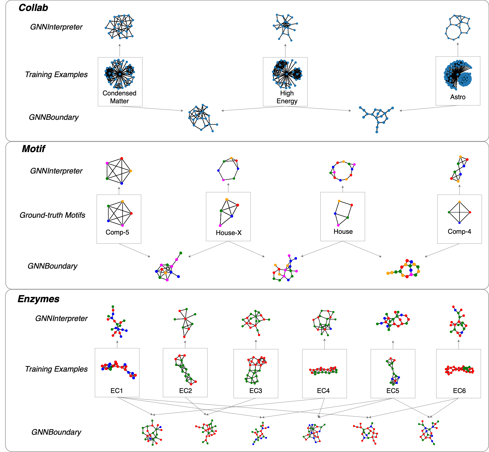

<div align="center">

<h1>GNNBoundary: Towards Explaining Graph Neural Networks through the Lens of Decision Boundaries</h1>

[Xiaoqi Wang](https://scholar.google.com/citations?user=i__pLDEAAAAJ&hl=en&oi=sra)<sup>1</sup>, &nbsp;
[Han-Wei Shen](https://scholar.google.com/citations?user=95Z6-isAAAAJ&hl=en)<sup>1</sup>, &nbsp;


<sup>1</sup>[The Ohio State University](), &nbsp;

ICLR 2024

</div>


## 🚀 Overview


## 📖 Introduction
While Graph Neural Networks (GNNs) have achieved remarkable performance on various machine learning 
tasks on graph data, they also raised questions regarding their transparency and interpretability. 
Recently, there have been extensive research efforts to explain the decision-making process of GNNs.
These efforts often focus on explaining why a certain prediction is made for a particular instance, 
or what discriminative features the GNNs try to detect for each class. However, to the best of our 
knowledge, there is no existing study on understanding the decision boundaries of GNNs, even though 
the decision-making process of GNNs is directly determined by the decision boundaries. To bridge this 
research gap, we propose a model-level explainability method called GNNBoundary, which attempts to gain
deeper insights into the decision boundaries of graph classifiers. Specifically, we first develop an 
algorithm to identify the pairs of classes whose decision regions are adjacent. For an adjacent class 
pair, the near-boundary graphs between them are effectively generated by optimizing a novel objective 
function specifically designed for boundary graph generation. Thus, by analyzing the near-boundary 
graphs, the important characteristics of decision boundaries can be uncovered. To evaluate the efficacy 
of GNNBoundary, we conduct experiments on both synthetic and public real-world datasets. The results 
demonstrate that, via the analysis of faithful near-boundary graphs generated by GNNBoundary, we can 
thoroughly assess the robustness and generalizability of the explained GNNs.

Paper: https://openreview.net/pdf?id=WIzzXCVYiH

## 🔥 How to use

### Notebooks
* `gnnboundary_collab.ipynb` contains the demo for the COLLAB dataset experiment in the paper.
* `gnnboundary_enzymes.ipynb` contains the demo for the ENZYME dataset experiment in the paper.
* `gnnboundary_motif.ipynb` contains the demo for the Motif dataset experiment in the paper.
* `model_training.ipynb` contains the demo for GNN classifier training.

### Model Checkpoints
* You can find the GNN classifier checkpoints in the `ckpts` folder.
* See `model_training.ipynb` for how to load the model checkpoints.

### Datasets
* Here's the [link](https://drive.google.com/file/d/1O3IRF9mhL2KCCU1eVlCEdssaf6y-pq2h/view?usp=sharing) for downloading the processed datasets.
* After downloading the datasets zip, please `unzip` it in the root folder.

### Environment
Codes in this repo have been tested on `python3.10` + `pytorch2.1` + `pyg2.5`.

To reproduce the exact python environment, please run:
```bash
conda env create -n gnnboundary -f environment.yml
conda activate gnnboundary
pip install torch_geometric
pip install --no-cache-dir --ignore-installed torch_scatter torch_sparse torch_cluster torch_spline_conv -f https://data.pyg.org/whl/torch-2.1.0+cpu.html
```

## 🖼️ Demo


## 🖊️ Citation
If you used our code or find our work useful in your research, please consider citing:
```
@inproceedings{wang2024gnnboundary,
title={{GNNB}oundary: Towards Explaining Graph Neural Networks through the Lens of Decision Boundaries},
author={Xiaoqi Wang and Han Wei Shen},
booktitle={The Twelfth International Conference on Learning Representations},
year={2024},
url={https://openreview.net/forum?id=WIzzXCVYiH}
}
```

## 🙏 Acknowledgement
The work  was supported in part by  the US Department of Energy SciDAC program DE-SC0021360, 
National Science Foundation Division of Information and Intelligent Systems IIS-1955764, 
and National Science Foundation Office of Advanced Cyberinfrastructure OAC-2112606.
